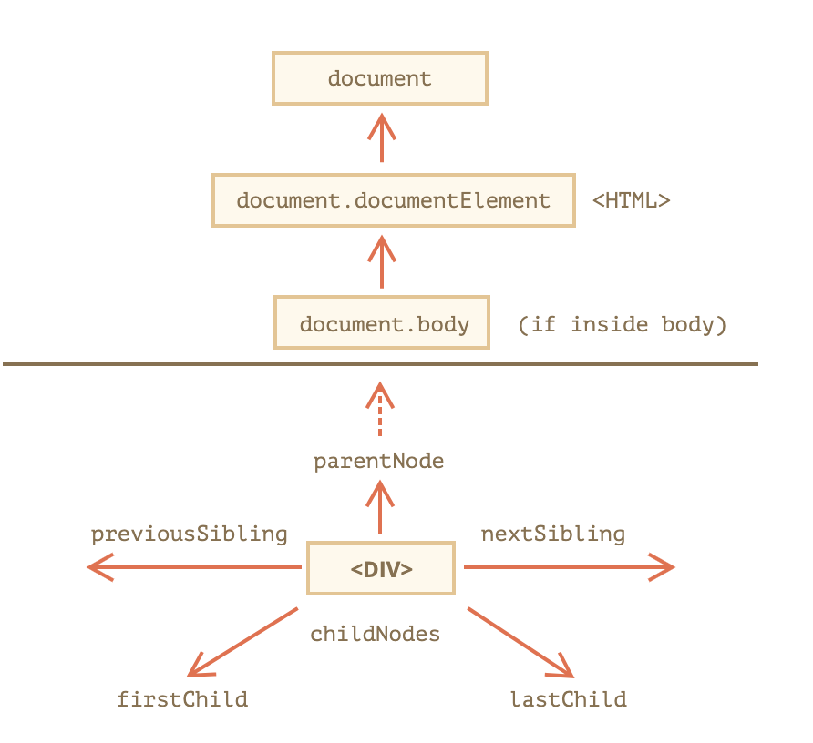

# 字符串模版, DOM遍历和事件绑定

<!-- vscode-markdown-toc -->
* 1. [字符串模版](#)
* 2. [Lodash模版](#Lodash)
* 3. [DOM遍历](#DOM)

<!-- vscode-markdown-toc-config
	numbering=true
	autoSave=true
	/vscode-markdown-toc-config -->
<!-- /vscode-markdown-toc -->

##  1. <a name=''></a>字符串模版

<!-- [文档](https://developer.mozilla.org/zh-CN/docs/Web/JavaScript/Reference/template_strings) -->


- 使用反引号
- 可使用多行字符串
- 可插入表达式
- 可嵌套模版

```js

/* 多行字符串 */
// 使用传统引号
console.log('string text line 1\n' +
'string text line 2');
// 或
console.log('string text line 1\n\
string text line 2');
// "string text line 1
// string text line 2"
// --
// 使用反引号
console.log(`string text line 1
string text line 2`);
// "string text line 1
// string text line 2"

/* 表达式 */
// 常规写法
var a = 5;
var b = 10;
console.log('Fifteen is ' + (a + b) + ' and\nnot ' + (2 * a + b) + '.');
// "Fifteen is 15 and
// not 20."
// --
// 字符串模版
var a = 5;
var b = 10;
console.log(`Fifteen is ${a + b} and
not ${2 * a + b}.`);
// "Fifteen is 15 and
// not 20."

/* 嵌套模版 */
// 常规写法
var classes = 'header'
classes += (isLargeScreen() ?
   '' : item.isCollapsed ?
     ' icon-expander' : ' icon-collapser');
// 字符串模版
const classes = `header ${ isLargeScreen() ? '' :
 `icon-${item.isCollapsed ? 'expander' : 'collapser'}` }`;
```

##  2. <a name='Lodash'></a>Lodash模版

[文档](https://lodash.com/docs/4.17.15#template)

用法
```js
var compiled = _.template([string=''], [options={}])
var s = compiled({/*替换内容*/})
```

例如
```js
var compiled = _.template('hello <%= user %>!');
compiled({ 'user': 'fred' });
// => 'hello fred!'

// Use the HTML "escape" delimiter to escape data property values.
var compiled = _.template('<b><%- value %></b>');
compiled({ 'value': '<script>' });
// => '<b>&lt;script&gt;</b>'

// Use the "evaluate" delimiter to execute JavaScript and generate HTML.
var compiled = _.template('<% _.forEach(users, function(user) { %><li><%- user %></li><% }); %>');
compiled({ 'users': ['fred', 'barney'] });
// => '<li>fred</li><li>barney</li>'

// 用原生的迭代方法也可以
var compiled = _.template('<% users.forEach(function(user) { %><li><%- user %></li><% }); %>');
compiled({ 'users': ['fred', 'barney'] });
// => '<li>fred</li><li>barney</li>'
```

##  3. <a name='DOM'></a>DOM遍历



根结点

- document.documentElement - 指\<html>标签
- document.body - 指\<body>标签

Element的遍历属性

- [children](https://developer.mozilla.org/zh-CN/docs/Web/API/ParentNode/children)
- [childNodes](https://developer.mozilla.org/zh-CN/docs/DOM/element.childNodes)
- [parentNode](https://developer.mozilla.org/zh-CN/docs/Web/API/Node/parentNode)
- [parentElement](https://developer.mozilla.org/zh-CN/docs/Web/API/Node/parentElement)
- [firstElementChild](https://developer.mozilla.org/zh-CN/docs/Web/API/ParentNode/firstElementChild)
- [firstChild](https://developer.mozilla.org/zh-CN/docs/Web/API/Node/firstChild)
- [lastElementChild](https://developer.mozilla.org/zh-CN/docs/Web/API/ParentNode/lastElementChild)
- [lastChild](https://developer.mozilla.org/zh-CN/docs/Web/API/Node/lastChild)
- [nextElementSibling](https://developer.mozilla.org/zh-CN/docs/Web/API/NonDocumentTypeChildNode/nextElementSibling)
- [nextSibling](https://developer.mozilla.org/zh-CN/docs/Web/API/Node/nextSibling)
- [previousElementSibling](https://developer.mozilla.org/zh-CN/docs/Web/API/NonDocumentTypeChildNode/previousElementSibling )
- [previousSibling](https://developer.mozilla.org/zh-CN/docs/Web/API/Node/previousSibling)
- [textContent](https://developer.mozilla.org/zh-CN/docs/Web/API/Node/textContent)
- [innerText](https://developer.mozilla.org/zh-CN/docs/Web/API/Node/innerText)
- [outerText](https://developer.mozilla.org/zh-CN/docs/Web/API/Node/outerText)
- [innerHTML](https://developer.mozilla.org/zh-CN/docs/Web/API/Element/innerHTML)
- [outerHTML](https://developer.mozilla.org/zh-CN/docs/Web/API/Element/outerHTML)
- [nodeType](https://developer.mozilla.org/zh-CN/docs/Web/API/Node/nodeType)
- [nodeName](https://developer.mozilla.org/zh-CN/docs/Web/API/Node/nodeName)
- [nodeValue](https://developer.mozilla.org/zh-CN/docs/Web/API/Node/nodeValue)

方法

- [contains()](https://developer.mozilla.org/zh-CN/docs/Web/API/Node/contains)
- [getRootNode()](https://developer.mozilla.org/zh-CN/docs/Web/API/Node/getRootNode)
- [appendChild()](https://developer.mozilla.org/zh-CN/docs/Web/API/Node/appendChild)
- [append()](https://developer.mozilla.org/zh-CN/docs/Web/API/ParentNode/append)
- [prepend()](https://developer.mozilla.org/zh-CN/docs/Web/API/ParentNode/prepend)
- [insertBefore()](https://developer.mozilla.org/zh-CN/docs/Web/API/Node/insertBefore)
- [insertAdjacentElement()](https://developer.mozilla.org/zh-CN/docs/Web/API/Element/insertAdjacentElement)
- [insertAdjacentText()](https://developer.mozilla.org/zh-CN/docs/Web/API/Element/insertAdjacentText)
- [insertAdjacentHTML()](https://developer.mozilla.org/zh-CN/docs/Web/API/Element/insertAdjacentHTML)
- [removeChild()](https://developer.mozilla.org/zh-CN/docs/Web/API/Node/removeChild)
- [remove()](https://developer.mozilla.org/zh-CN/docs/Web/API/ChildNode/remove)
- [replaceChild()](https://developer.mozilla.org/zh-CN/docs/Web/API/Node/replaceChild)

- [document.createElement()](https://developer.mozilla.org/zh-CN/docs/Web/API/Document/createElement)


